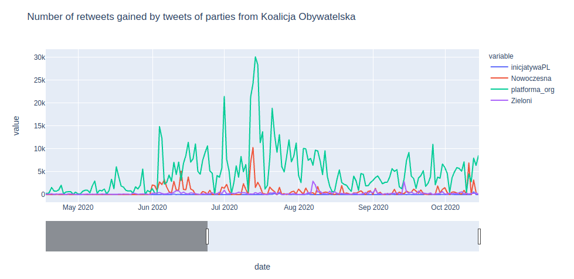

# Polish-Parties-Twitter-Activity
Visualisations of the activity of polish parties on twitter. 




## How run the visualisations

Just run `jupyter notebook` and open one of the follwing notebooks:

- [Distribution-of-activity](notebooks/Distribution-of-activity.ipynb)
- [Number-of-tweets-and-retweets-in-time](notebooks/Number-of-tweets-and-retweets-in-time.ipynb)
- [Popularity-of-tweets-in-time](notebooks/)

At the top of each notebook we provide a more detail descripion about what the visualisation actually shows.

### Data

We provide a set of processed data polish parties such as: 

```python
[pisorgpl, Porozumienie__, SolidarnaPL], 
[platforma_org, Nowoczesna, Zieloni, inicjatywaPL], 
[KONFEDERACJA_, RuchNarodowy, Partia_KORWiN], 
[nowePSL, KUKIZ15],
[__Lewica, partiarazem]
```


## How to configure the enviroment

In order to run everything properly, you need to install a few packages. 

The reccomended way to install all dependencies is to use `Docker`, but if for some reason you don't want we provide an instructin do to same with conda. 

### Docker

Firt build the docker image using the provided [Dockerfile](Dockerfile)

```bash 
docker build . -t polish-twitter
```

and then run created docker image, we suggest to use the follwing command

```bash 
docker run -p 8888:8888 --mount type=bind,source=path/to/the/project/folder/Polish-Parties-Twitter-Activity,target=/home/jovyan/work polish-twitter 
```

After that the jupyter server will be started (the console will show the link) and you will be able to run the visualisation notebooks


### Conda 

Create and activate new conda env 

```bash
conda create -n twitter python=3.6

conda activate twitter
```

Clone and install [this](https://github.com/himanshudabas/twint) modification of `twint` (at the time when this repo is created, it is the only one that supporsts retweets) 

```bash
git clone https://github.com/himanshudabas/twint.git
cd twint 
pip3 install . -r requirements.txt
```

Install the required packages: `tqdm`, `pandas` and `plotly`

```
pip install tqdm

pip install pandas

conda install -c plotly plotly=4.11.0

conda install -c conda-forge notebook
```


## How to download your own data

To download data use `generate_csv_with_tweets_posted_by_a_user` function from [scripts/twitter_scrapper](twitter_scrapper)

```python
def generate_csv_with_tweets_posted_by_a_user(user_name, since, save_dir=""):
    c = twint.Config()
    c.Username = user_name
    c.Since = since
    c.Store_csv = True
    c.Output = f"{join(save_dir, user_name)}.csv"

    c.Retweet = True
    twint.run.Profile(c)
```

And to show visualisations, preprocess downloaded `.csv` using all functions from [processed_data_generator](processed_data_generator). 

## Authors
* [Piotr Mazurek](https://github.com/tugot17)

## License

This project is licensed under the MIT License - see the [LICENSE](LICENSE) file for details
